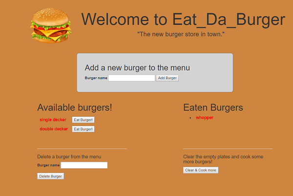

# Eat_Da_Burger 
## Week 15 Homework - Full stack app with mysql
.

View project on heroku at https://boiling-caverns-12450.herokuapp.com/
.    
.    

### Introduction & Instructions ###

Eat _Da_Burger is a single page restaurant app which presensts users with a menu of burgers.   
.  
.  

.  
.  

Users can add the burger of their choice to the menu using the add a burger box at the top of the page.  
  
They can then eat a burger of their choice by clicking the 'eat burger' button which then transfers the burger to the opposite side of the page, mimicking it having been eaten.  
   
Users can create and eat as many burgers as they want, then reset the menu by clicking the 'clear plates and cook more burgers' button.   
  
Users can also delete burgers they don't like from the menu by entering the burgers name in the' delete burger' form at the bottom of the menu.    

### The application uses: ###
  
1. node.js
2. express.js
3. mysql database

and demonstrates:
  
4. model-view-controller organisation
5. use of ORM to interface between the app and database
6. deployment to heroku
 
### NPM Packages ###

1. npm install express 
2. npm install mysql
3. npm install body-parser
4. npm install method-override

# Copyright

Mathew Hall (C) 2018. All Rights Reserved.
  

# sequelizedBurger
