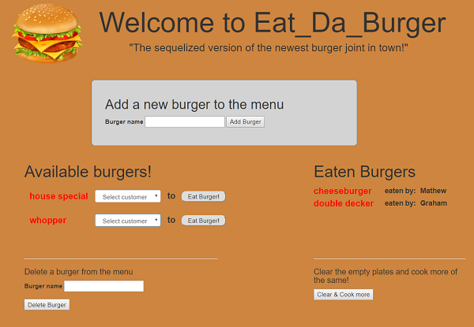

# Eat_Da_Burger 
## Week 16 Homework - Full stack app with mysql & sequelize
.

View project on heroku at https://salty-temple-69409.herokuapp.com/
.    
.    

### Introduction & Instructions ###

Eat _Da_Burger - the sequelized version -  is a single page restaurant app.   
.  
.  

.  
.  

Users can add the burger of their choice to the menu using the add a burger box at the top of the page.  
  
They can then eat a burger of their choice by clicking the 'eat burger' button, but fisrt they must identify themselves as a customer. If they are a returning customer they can click on their name from the dropdown menu next to the burger or if they are a new customer they can select 'nw customer' and they will be tiaken to a box to fill in their details.

When a customer eats a burger, the burger is transferred  to the opposite side of the page, mimicking it having been eaten. The customer who ate the burger is displayed alongside the eaten burger
   
Users can create and eat as many burgers as they want, then reset the menu by clicking the 'clear plates and cook more burgers' button.   
  
Users can also delete burgers they don't like from the menu by entering the burgers name in the' delete burger' form at the bottom of the menu.    

### The application uses: ###
  
1. node.js
2. express.js
3. mysql database (burger_db with two tables, one for burgers and one for customers)
4. sequelize

and demonstrates:
  
4. model-view-controller organisation
5. use of sequelize to interface between the app and database
6. deployment to heroku
 
### NPM Packages ###

1. npm install express 
2. npm install mysql
3. npm install body-parser
4. npm install method-override
5. npom install sequelize

# Copyright

Mathew Hall (C) 2018. All Rights Reserved.
  

# sequelizedBurger
